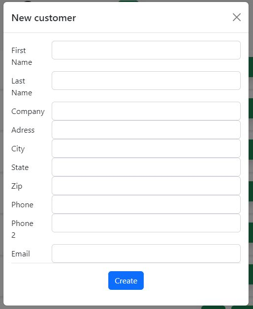
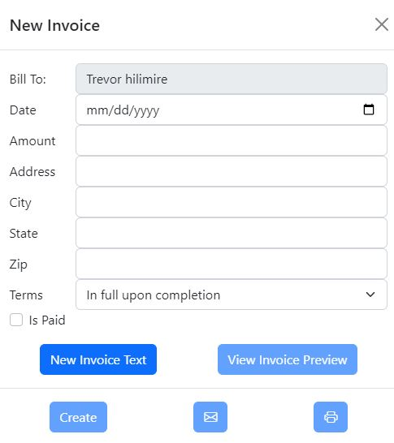
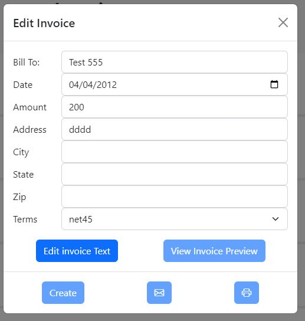

# Small Buisness Invoicing and Proposal Tracker 


## Description

A web based application that makes customer, invoices and proposal management as simple as possibe

## Table of Contents

* [Installation](#installation) 
* [Usage](#usage) 
* [Features](#features) 
* [License](#license) 


## Installation
To install necessary dependencies, run the following command:
  ```
  npm i
  ```
To generate sequelize model from exsisting database run:
  ```
  node sequelize-auto + database creds
  ```


## Usage

Install dependencies, include a .env file in root with your database credentials, create a auth0 app for authentification and apply correct redirect urls, and enjoy!


## Features

- search customers invoices and proposals
- edit customers invoices and proposals
- create customers invoices and proposals





## License

This project is licensed under the GNUGPLv3

## Questions

If you have any questions about the repo, open an issue or contact me directly at trevorHilimire@gmail.com
This project was created by Github user: [Trv893](https://github.com/trv893/)
